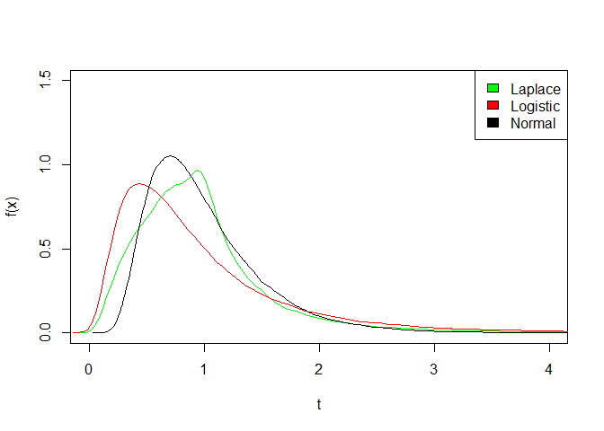
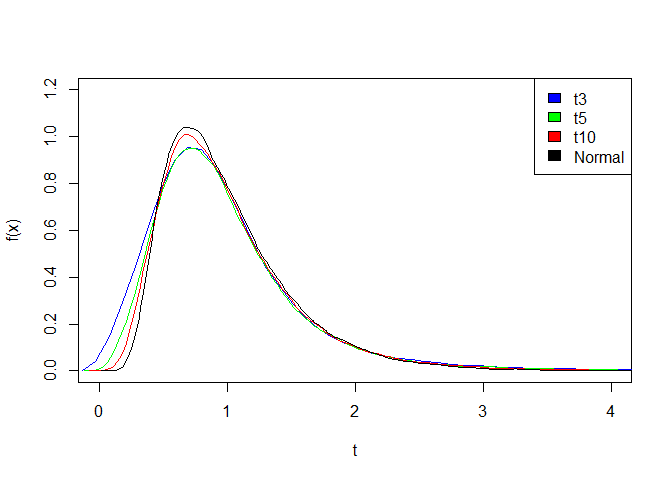

# Package for a General Class of Inverse Gaussian Distributions


This is the R package of Víctor Leiva, Hugo Hernández, and Antonio Sanhueza with some improvements.

- bug fix in *rigt* in the laplace or logistic kernel case
- speed up of *rigt* by replacing the for-loop with a vectorized operation
- changing the code of *rigt* such that the formulas are more similar to the ones in the paper

Now the density function plots look similar to Figure 1 in the paper
*An R Package for a General Class of Inverse Gaussian Distributions* (Journal of Statistical Software, Volume 26, Issue 4, 2008)


```r
rigtExampleData <- data.frame( 
  Laplace  = rigt(100000,  mu = 1, lambda = 4, kernel = "laplace"),
  Logistic = rigt(100000,  mu = 1, lambda = 4, kernel = "logistic"),
  Normal   = rigt(100000,  mu = 1, lambda = 4, kernel = "normal"))
dens <- apply(rigtExampleData, 2, density)
plot(NA, xlim = c(0,4), xlab= "t",   ylim = c(0,1.5), ylab = "f(x)")
mapply(lines, dens, col = c("green","red","black"))
legend("topright", legend = names(dens), fill =  c("green","red","black") )
```

<!-- -->


```r
rigtExampleData <- data.frame( 
  t3     = rigt(100000,  mu = 1, lambda = 4, kernel = "t", nu = 3),
  t5     = rigt(100000,  mu = 1, lambda = 4, kernel = "t", nu = 5),
  t10    = rigt(100000,  mu = 1, lambda = 4, kernel = "t", nu = 10),
  Normal = rigt(100000,  mu = 1, lambda = 4, kernel = "normal"))
dens <- apply(rigtExampleData, 2, density)
plot(NA, xlim = c(0,4), xlab= "t", ylim = c(0,1.2), ylab = "f(x)")
mapply(lines, dens, col = c("blue", "green","red","black"))
legend("topright", legend = names(dens), fill = c("blue", "green","red","black"))
```

<!-- -->
